# Adivinhator

**Disciplina**: FGA0210 - PARADIGMAS DE PROGRAMAÇÃO - T01 <br>
**Nro do Grupo**: 04<br>
**Paradigma**: Lógico<br>

## Alunos
|Matrícula | Aluno |
| :--: | :--: |
| 20/2045624 | [Abdul hannan](https://github.com/hannanhunny01)	|
| 21/1029147 | [Arthur de Melo Viana](https://github.com/arthurmlv)	|
| 19/0026758 | [Deivid Carvalho](https://github.com/deivid-a1) |	
| 21/1062867 | [Felipe de Jesus Rodrigues](https://github.com/felipeJRdev) |
| 17/0108341 | [Levi de Oliveira Queiroz](https://github.com/LeviQ27) |	
| 17/0111059 | [Matheus Fonseca Sousa](https://github.com/gatotabaco) |	
| 19/0093331 | [Matheus Costa Gomes](https://github.com/mc-gomes) |	
| 21/1029559 | [Rafael Brito Bosi Rodrigues](https://github.com/StrangeUnit28) |	
| 16/0149410 | [Yudi Yamane de Azevedo](https://github.com/yudi-azvd)	| 

## Sobre 

Este projeto é uma implementação do jogo de adivinhação "Akinator", onde o sistema tenta adivinhar o que o usuário está pensando com base em perguntas. O jogo é desenvolvido em Prolog, utilizando um conjunto de regras de inferência para realizar a interação com o usuário, que deve pensar em um animal e responder às perguntas feitas pelo sistema. A cada resposta, o sistema utiliza essas informações para restringir as opções e tentar adivinhar o animal.

A estrutura do sistema é baseada em uma interface gráfica que facilita a interação com o usuário. A interface é construída com a biblioteca pce, que é integrada ao Prolog, permitindo a criação de diálogos e botões interativos. O fluxo do jogo é projetado de forma a guiar o usuário por uma série de perguntas, tentando adivinhar o animal com base nas características informadas.

### Funcionalidades Principais

- **Interface Gráfica Interativa:** A aplicação apresenta um ambiente gráfico onde o usuário pode interagir, começando o jogo, respondendo às perguntas e recebendo a tentativa de adivinhação do sistema.
- **Perguntas Dinâmicas:** O sistema seleciona perguntas baseadas em características dos animais e no progresso das respostas anteriores. As perguntas são feitas de forma a dividir as opções de maneira eficiente, utilizando as respostas do usuário (sim, não ou não sei) para ajustar as possibilidades.
- **Inferência e Regras:** O sistema usa regras de inferência para determinar quais perguntas fazer, com base nas características dos animais disponíveis. Ele ajusta as opções de animais possíveis a cada resposta do usuário, aplicando uma lógica de exclusão ou inclusão.
- **Adição de Novos Animais:** Caso o sistema não consiga adivinhar o animal, ele oferece a opção de adicionar um novo animal à base de dados, incluindo suas características. Isso permite que o jogo aprenda novos animais à medida que é jogado.

## Screenshots

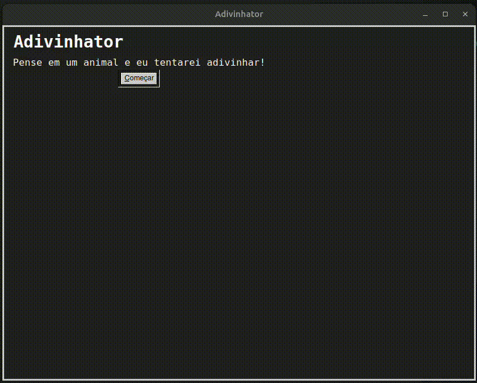

## Instalação 

**Linguagens**: Prolog 9.2<br>
**Tecnologias**: SWI-Prolog, Biblioteca PCE para interface gráfica<br>

### Pré-requisitos

Antes de rodar o projeto, verifique se você tem o SWI-Prolog instalado na versão 9.2 ou superior. O SWI-Prolog é uma implementação de Prolog que oferece uma ampla gama de recursos e bibliotecas, incluindo a biblioteca `pce`, que é usada para a interface gráfica do jogo.

Você pode baixar o SWI-Prolog no [site oficial](https://www.swi-prolog.org/Download.html).

### Como rodar o projeto

#### Windows

1. **Instalar o SWI-Prolog**:
   - Acesse o [site oficial do SWI-Prolog](https://www.swi-prolog.org/Download.html).
   - Baixe o instalador para Windows.
   - Execute o instalador e siga as instruções para concluir a instalação.

2. **Rodar o projeto**:
   - Abra o terminal (Prompt de Comando ou PowerShell).
   - Navegue até a pasta onde está localizado o arquivo `main.pl` (utilize o comando `cd` para navegar até o diretório correto).
   - Execute o SWI-Prolog com o comando:
     ```bash
     swipl
     ```
   - Carregue o arquivo principal do projeto:
     ```prolog
     ?- [main].
     ```
   - Isso irá carregar o jogo e abrir a interface gráfica.

#### macOS

1. **Instalar o SWI-Prolog**:
   - Se você não tem o Homebrew instalado, abra o terminal e execute:
     ```bash
     /bin/bash -c "$(curl -fsSL https://raw.githubusercontent.com/Homebrew/install/HEAD/install.sh)"
     ```
   - Depois de instalar o Homebrew, instale o SWI-Prolog com o comando:
     ```bash
     brew install swi-prolog
     ```

2. **Rodar o projeto**:
   - Abra o terminal.
   - Navegue até a pasta onde está localizado o arquivo `main.pl` (utilize o comando `cd`).
   - Execute o SWI-Prolog:
     ```bash
     swipl
     ```
   - Carregue o arquivo principal do projeto:
     ```prolog
     ?- [main].
     ```
   - Isso irá carregar o jogo e exibir a interface gráfica.

#### Linux (opcional)

1. **Instalar o SWI-Prolog**:
   - No Linux, você pode instalar o SWI-Prolog através do gerenciador de pacotes. No Ubuntu, por exemplo:
     ```bash
     sudo apt-get install swi-prolog
     ```

2. **Rodar o projeto**:
   - Abra o terminal.
   - Navegue até a pasta onde está o arquivo `main.pl`:
     ```bash
     cd /caminho/para/o/projeto
     ```
   - Execute o SWI-Prolog:
     ```bash
     swipl
     ```
   - Carregue o arquivo principal:
     ```prolog
     ?- [main].
     ```


### Observações

- Certifique-se de que a biblioteca `pce` esteja corretamente instalada no seu ambiente SWI-Prolog.
- Caso haja algum problema ao rodar a interface gráfica, verifique se a versão do SWI-Prolog é compatível com a biblioteca `pce`.

Sinta-se à vontade para contribuir com melhorias ou relatar problemas no repositório.


## Uso 

Este projeto é um jogo de adivinhação de animais, onde o sistema faz perguntas ao usuário para tentar descobrir qual animal ele está pensando. O projeto possui duas versões: uma prototípica, implementada no terminal, e uma versão final, desenvolvida em Prolog com a biblioteca `pce`, que oferece uma interface gráfica.

A seguir, explicamos como utilizar o projeto final com a interface gráfica e, em seguida, a versão prototípica, que pode ser executada diretamente no terminal.

### Como Rodar o Projeto

1. **Abra o terminal.**
2. **Execute o SWI-Prolog** com o comando:

```bash
swipl
```

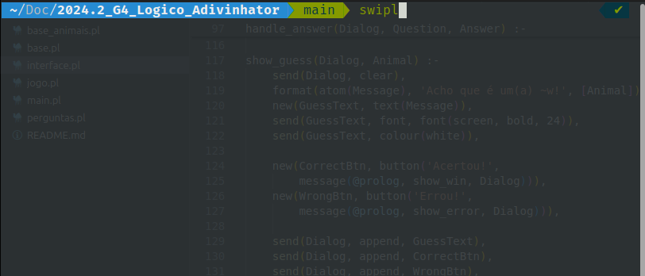

Carregue o arquivo principal (por exemplo, main.pl) com o comando:

```prolog
?- [main].
```

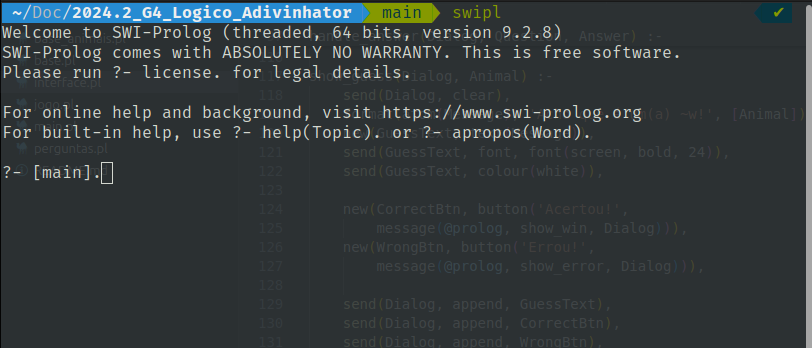

Isso iniciará o jogo, e você poderá interagir com a interface gráfica.

3. **Inicialização do Jogo**

Ao iniciar o programa, o menu principal será exibido. O título do jogo é Adivinhator e o subtítulo instrui o jogador a pensar em um animal, pois o sistema tentará adivinhar qual é.

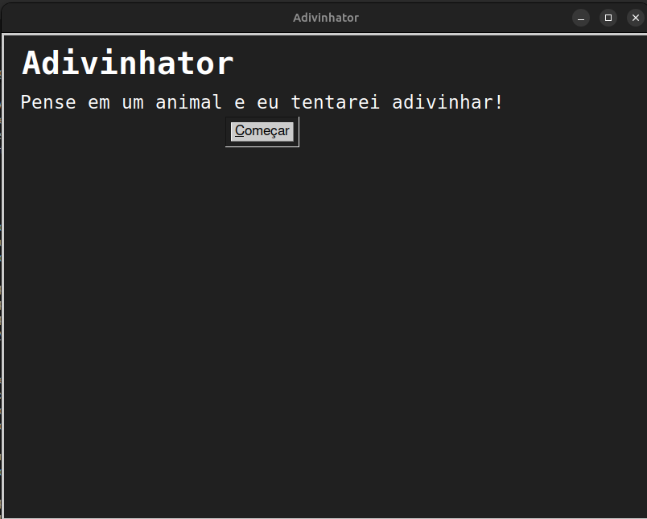

Clique no botão "Começar" para iniciar o jogo. Isso iniciará o processo de adivinhação.

4. **Processo de Perguntas**

O sistema começará a fazer uma série de perguntas para tentar adivinhar o animal em que você está pensando. Para cada pergunta, você deverá responder "Sim", "Não" ou "Não Sei".

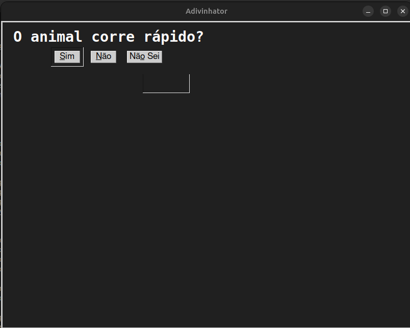

- Sim: Significa que o animal possui a característica relacionada à pergunta.
- Não: Significa que o animal não possui a característica.
- Não Sei: Caso você não saiba a resposta, o jogo continuará tentando adivinhar.

Após cada resposta, o sistema reduzirá as possibilidades de animais com base nas suas escolhas. O jogo irá continuar fazendo novas perguntas até que ele adivinhe o animal ou esgote todas as opções.

5. **Adivinhação do Animal**

Se o sistema conseguir adivinhar o animal, uma mensagem será exibida com a suposição do sistema, junto com dois botões:

- Acertou: Caso o animal esteja correto.
- Errou: Caso o animal não esteja correto.

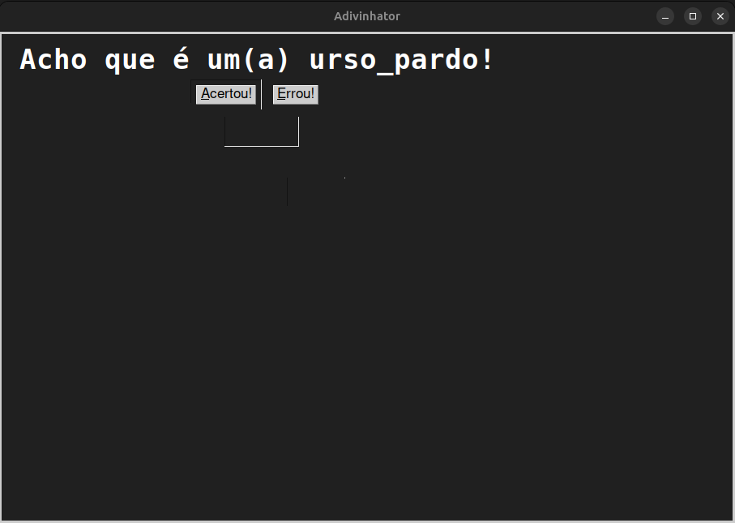

Se o sistema não conseguir adivinhar o animal, ele exibirá uma mensagem de erro junto com a opção de adicionar um novo animal à base de dados.

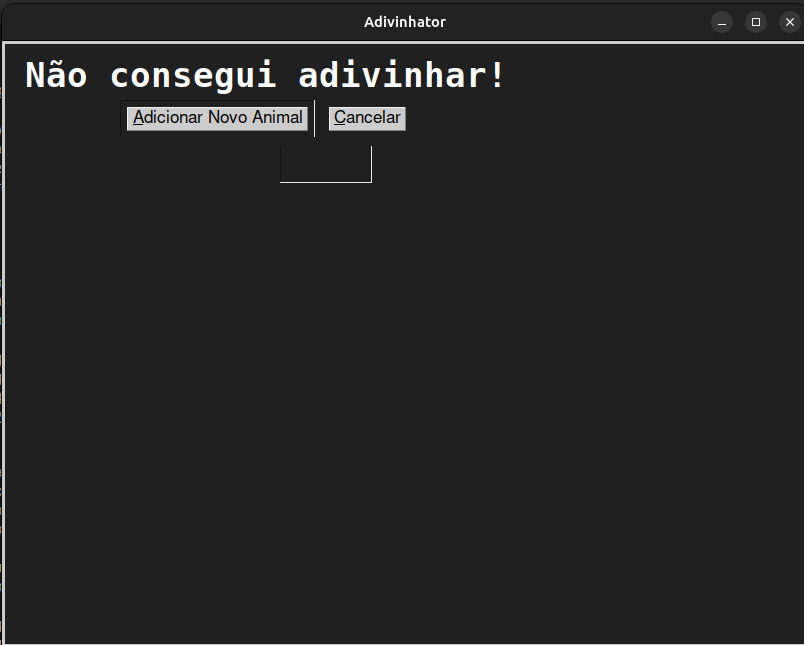

6. **Adicionando um Novo Animal**

Caso o sistema erre, você terá a opção de adicionar um novo animal à base de dados. Para isso, será solicitado o nome do animal e suas características (separadas por vírgulas).


- Passo 1: Informe o nome do animal que você estava pensando.
- Passo 2: Informe as características do animal, separadas por vírgulas (por exemplo, "tem penas, voa, pequeno").
- Passo 3: Clique no botão "Salvar" para adicionar o novo animal à base de dados e reiniciar o jogo.

O animal salvo será escrito diretamente no arquivo [base.pl](./base.pl), assim como mostrado na imagem abaixo.

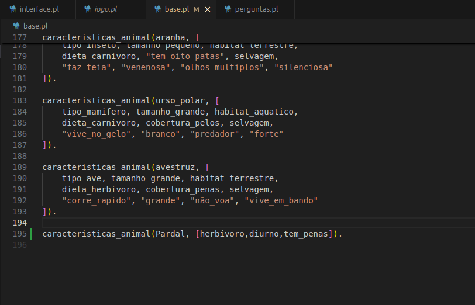

7. **Finalizando o Jogo**

Quando o jogo termina, você pode optar por jogar novamente clicando em "Jogar Novamente" ou sair clicando em "Cancelar". O jogo será reiniciado com a base de dados atualizada, levando em consideração os novos animais adicionados.

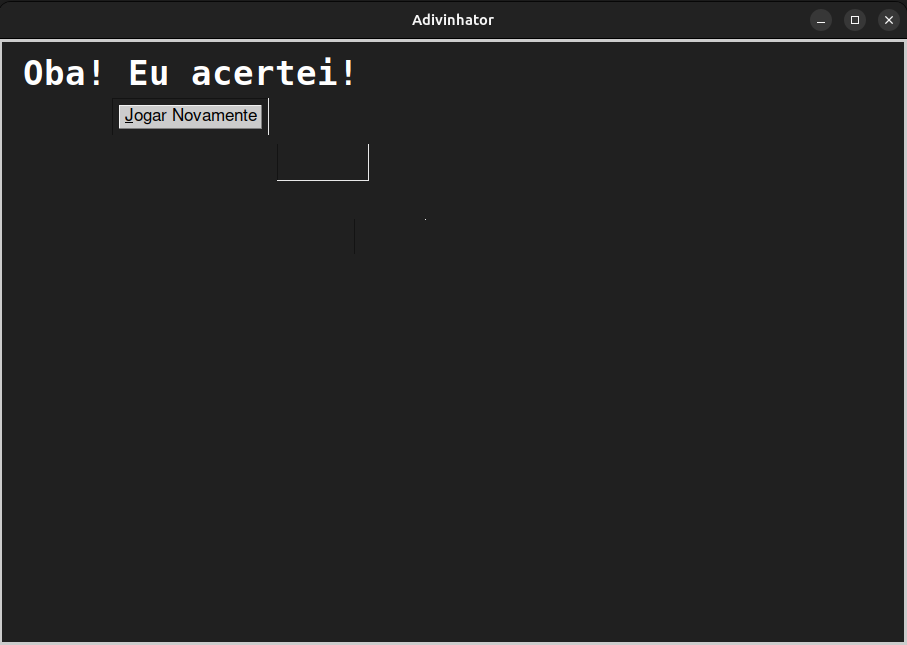

### Fluxo Completo

O fluxo do jogo pode ser resumido como:

- Menu inicial: Iniciar o jogo clicando em "Começar".
- Perguntas: O sistema fará perguntas para adivinhar o animal.
- Adivinhação: O sistema tenta adivinhar o animal.
- Erro: Caso o sistema erre, o usuário pode adicionar um novo animal à base de dados.
- Finalização: O jogo pode ser reiniciado ou finalizado.

### Execução da Versão Prototípica 

1. **Abra o terminal.**
2. **Execute o SWI-Prolog** com o comando:

```bash
swipl
```

3. Carregue o arquivo **prototipo** com o comando:

```prolog
?- [prototipo].
```

. Se tudo der certo, você deve receber o seguinte retorno:

```prolog
?- [prototipo].
true.
```

4. Execute a função principal (main) da seguinte forma:

```prolog
?- main.
```
Após isso, você poderá interagir com o sistema respondendo às perguntas com "sim", "não" ou "não sei".

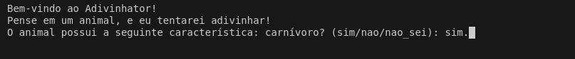

Responda às perguntas até que o Adivinhator descubra o animal que você pensou:

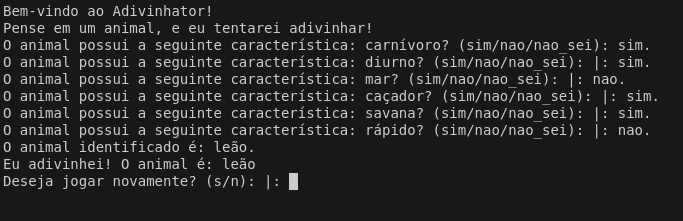

Caso ele não consiga adivinhar o animal, será exibida a seguinte mensagem:

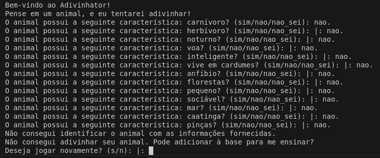

Depois de finalizar vc pode decidir se quer jogar de novo respondendo com "s." ou "n." :


### Observações

A versão terminal não requer a biblioteca ``pce``, pois não há interface gráfica e também não possui a funcionalidade de adicionar um novo animal.

## Vídeo
Adicione 1 ou mais vídeos com a execução do projeto.
Procure: 
(i) Introduzir o projeto;
(ii) Mostrar passo a passo o código, explicando-o, e deixando claro o que é de terceiros, e o que é contribuição real da equipe;
(iii) Apresentar particularidades do Paradigma, da Linguagem, e das Tecnologias, e
(iV) Apresentar lições aprendidas, contribuições, pendências, e ideias para trabalhos futuros.
OBS: TODOS DEVEM PARTICIPAR, CONFERINDO PONTOS DE VISTA.
TEMPO: +/- 15min

## Participações
Apresente, brevemente, como cada membro do grupo contribuiu para o projeto.

|       Nome do Membro        | Contribuição                                                                 | Significância da Contribuição para o Projeto (Excelente/Boa/Regular/Ruim/Nula) | Comprobatórios (ex. links para commits) |
| :-------------------------: | ---------------------------------------------------------------------------- | :----------------------------------------------------------------------------: | :-------------------------------------: |
| [Abdul hannan](https://github.com/hannanhunny01)	|  |  |   |
| [Arthur de Melo Viana](https://github.com/arthurmlv)	| Criação de uma das estruturas para a organização das tabelas para a base de dados dos animais e População da base | Boa |  [Estrutura](https://github.com/UnBParadigmas2024-2/2024.2_G4_Logico_Adivinhator/commit/d0dd529884c018c16e4652d63bc0a71ca456de5c) e [População](https://github.com/UnBParadigmas2024-2/2024.2_G4_Logico_Adivinhator/commit/25f916465e2b04247829e65cf628ab4727e7ecab) |
| [Deivid Carvalho](https://github.com/deivid-a1) | Criação das bases iniciais, através do padrão implementado por um dos membros. Através disso, ampliação da base de animais. Quando foi implementada a base, integração junto as demais desenvolvidas pelos restante do grupo, para que as duplas pudessem desenvolver o jogo Akinator baseado nessa base.  | Boa |   |
| [Felipe de Jesus Rodrigues](https://github.com/felipeJRdev) | Adicionei regras para ser utilizada para criação de perguntas de acordo com a base de dados fornecida para a versão prototípica (terminal) | Boa | [5d85be8c374c2d5499dadf48f52becfba0c851ae](https://github.com/UnBParadigmas2024-2/2024.2_G4_Logico_Adivinhator/commit/5d85be8c374c2d5499dadf48f52becfba0c851ae) e [e653d79f90b39ab639554517f0c5b6e5fd066a09](https://github.com/UnBParadigmas2024-2/2024.2_G4_Logico_Adivinhator/commit/e653d79f90b39ab639554517f0c5b6e5fd066a09) e [8e68dee9f8fb5c4f814242d6e131e9d09ca702d0](https://github.com/UnBParadigmas2024-2/2024.2_G4_Logico_Adivinhator/commit/8e68dee9f8fb5c4f814242d6e131e9d09ca702d0) e [6d73811c2e5acf246034dd79e26a491cc7b44c5e](https://github.com/UnBParadigmas2024-2/2024.2_G4_Logico_Adivinhator/commit/6d73811c2e5acf246034dd79e26a491cc7b44c5e) |
| [Levi de Oliveira Queiroz](https://github.com/LeviQ27) |	  |  |   |
| [Matheus Fonseca Sousa](https://github.com/gatotabaco) |	Contribuí apenas na parte de documentação e participei das reuniões do grupo.  | Ruim |   |
| [Matheus Costa Gomes](https://github.com/mc-gomes) | Contribuí com a criação e estruturação da base de dados  | Boa | Hash dos commits: 41ebed94e514957b4cd1d6ec92971a9ca1d9da43; 35f4f32e4fa85f2515525f00cc1d3b140809b6ea; 1baee24414a0dd8b76eb2a1ff6af41c758cf1953; d4c454a631ad5eef0fcab15b2be08ed5f8c73e6e;  |
| [Rafael Brito Bosi Rodrigues](https://github.com/StrangeUnit28) |	Adicionei novas perguntas e animais, além de separar o banco de dados dos animais das perguntas. Adicionei o botão "não sei" ao front e criei a funcionalidade de adicionar animais. Escrevi grande parte da documentação do projeto  | Excelente  |  [Perguntas e separação dos bancos](https://github.com/UnBParadigmas2024-2/2024.2_G4_Logico_Adivinhator/commit/e144627bdfd7fe9288cf96bbc442b07897c42eb3), [Botão de não sei e novos animais](https://github.com/UnBParadigmas2024-2/2024.2_G4_Logico_Adivinhator/commit/bde5c48707832819ff5072470678939a75587005), [Documentação](https://github.com/UnBParadigmas2024-2/2024.2_G4_Logico_Adivinhator/commit/1390d510a12ff2c49b244b24121ff1ae71363c5c)  |
| [Yudi Yamane de Azevedo](https://github.com/yudi-azvd)	| Adicionei alguns animais e fiz a interface gráfica  | Boa | [fafb409f52d59417c5b194e72e172f6f2a715aaa](https://github.com/UnBParadigmas2024-2/2024.2_G4_Logico_Adivinhator/commit/fafb409f52d59417c5b194e72e172f6f2a715aaa) e [ea9b2c86b6a7692afdb2f3544738c3b4b7a58034](https://github.com/UnBParadigmas2024-2/2024.2_G4_Logico_Adivinhator/commit/ea9b2c86b6a7692afdb2f3544738c3b4b7a58034) e [82b97080b07b3f9839e242e6bb4e5e9f37a4a71c](https://github.com/UnBParadigmas2024-2/2024.2_G4_Logico_Adivinhator/commit/82b97080b07b3f9839e242e6bb4e5e9f37a4a71c) e [5081b0a337ef9c3bbc35689f18fc45a8c1f11a1b](https://github.com/UnBParadigmas2024-2/2024.2_G4_Logico_Adivinhator/commit/5081b0a337ef9c3bbc35689f18fc45a8c1f11a1b)  |

## Outros 
Nesse tópicos estão disponibilizadas algumas percepções dos membros do grupo, que foram coletadas através de um [Formulário Google](https://forms.gle/ugf73WBVsot1aydu6) e pode ter suas respostas checadas no [link](https://docs.google.com/spreadsheets/d/1YZUAIQYfyW59Kl_nV3tkhs_0eo9EV-L4dbEhA5MT0bg/edit?usp=sharing). Em alguns subtópicos, percepções reduntantes foram enxugadas para melhor compreensão do leitor.

### Lições Aprendidas e percepções
Relatos de cada um dos colegas:
 - "O paradigma lógico, especialmente com o uso do Prolog, é único porque muda completamente a maneira como pensamos sobre problemas e como interagimos com a máquina. Ao contrário de linguagens imperativas, onde o foco está em definir como o programa deve realizar as tarefas, o paradigma lógico concentra-se no quê deve ser verdade."
 - "Achei um paradigma bem interessante devido sua lógica por trás da implementação, que é capaz de fazer inferências e permitir de forma preditiva."
 - "Achei bem interessante a capacidade da linguagem de fazer as análises por debaixo dos panos, podendo trazer bons resultados preditivos a depender da base."
 - "Desenvolver este projeto foi uma experiência incrível para aprofundar meus conhecimentos sobre o paradigma lógico e explorar suas particularidades, especialmente usando Prolog. Trabalhar com fatos, regras e inferências me ajudou a entender de forma mais prática como a lógica declarativa funciona no dia a dia. Vi, também, como é possível criar soluções inteligentes e dinâmicas, ao mesmo tempo em que enfrentei os desafios únicos desse estilo de programação."
 - "Aprendi o papel do paradigma lógico, especialmente como as relações e fatos contribuem para uma boa modelagem do conhecimento."
 - "Esse jogo utiliza a inferência lógica para deduzir informações a partir das perguntas feitas ao jogador, ilustrando o poder do paradigma lógico para criar sistemas interativos baseados em raciocínio automático."
 - "Aprendi a criar e ampliar uma base de conhecimento de animais, integrando-a com as contribuições dos colegas. Essa base foi usada para desenvolver um jogo estilo Akinator, mostrando como o trabalho em equipe e a lógica estruturada podem criar algo interativo e divertido."
 - "Aprendi a lidar com a estrutura do que seriam as tabelas (os fatos) de um banco de dados não-relacional. Contudo, o funcionamento e a lógica organizacional é bem diferente de um banco relacional. Tentei aplicar a lógica do banco relacional de guardar dados reais relevantes ao escopo, mas a relação entre os fatos ficou bem diferente do que imaginei."
 - "Aprendi o básico da biblioteca XPCE."

### Fragilidades

- Nosso projeto não possui uma grande quantidade de informações, nossa base é pequena e construída com muito esforço dos colegas, não sendo algo de nível profissional (Uma base adequado para um grande jogo).
- Não foi feita uma rede semântica forte, apenas relações binárias.
- Por conta da pequena base e poucas perguntas, muitas vezes não encontra o animal pensado.
- Adicionar animais pode não funcionar como esperado.
- Performance um pouco limitada durante a jogabilidade, talvez tornando muito fácil para o programa fazer as análises
- O jogo ainda não esta conseguindo muito bem filtrar pelos animais, pois apesar de existirem características o suficiente para haver uma diferenciação entre todos os animais presentes no banco, as perguntas não são suficientes para filtrar entre eles.

### Trabalhos Futuros.

- Mais interações com o usuário.
- Otimização das consultas dentro do prolog. Não consegui fazer algo parecido com os índices do SQL. Talvez melhorar a organização das tabelas e, principalmente, das características dos animais a fim de melhorar a rede semântica.
- Adição de dinâmica de entidades. Por exemplo, se o Adivinhator não acertou depois de todas as perguntas, o programa salva as características respondidas pelo jogador de maneira que na próxima partida o programa saiba dar a resposta correta. É uma inserção na base de dados.
- Aumentar a base de perguntas para melhorar a capacidade de encontrar o animal correto.
- Uma base de dados mais ampla e detalhada, para melhorar a aplicação
- Perguntas sejam ainda mais precisas e que consigam filtrar entre uma variedade maior de opções. Além disso, penso em ampliar os temas abordados, permitindo que o jogo vá além dos animais e explore outros assuntos, tornando a experiência mais rica e diversificada.

## Fontes
- [Guia de usuário do SWI Prolog](https://www.swi-prolog.org/download/xpce/doc/prolog/userguide.pdf), acesso em 13/12/2024.
- [Youtube Recommendation](https://github.com/UnBParadigmas2023-2/2023.2_G2_Logico_YouTubeRecommendation), acesso em 13/12/2024.
- [Documentação Prolog](https://www.swi-prolog.org/pldoc/index.html) acesso em 13/12/2024.
- [Biblioteca pce no SWI-Prolog](https://www.swi-prolog.org/packages/xpce/) acesso em 13/12/2024.
